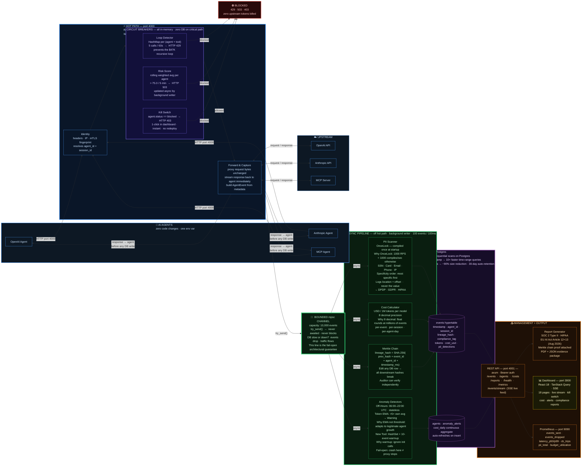

# Govrix Scout — Architecture Diagram (Full Slide, WHY-annotated)
### Go to mermaid.live → paste code → Actions → PNG → insert into PowerPoint full-bleed

---

## Mermaid Code — paste this exactly

---

## Export settings for best PPT quality

1. In mermaid.live top-right: click **Actions → PNG**
2. Before downloading, set **Scale: 3** (or highest available) — this gives crisp resolution on a projector
3. Save as `architecture-diagram.png`

---

## Insert into PowerPoint

- Slide layout: **blank slide** (no title — the diagram is the whole slide)
- Insert → Pictures → This Device → select the PNG
- Drag to fill **edge-to-edge** — no white margins
- The diagram is already dark background — it will look native on the dark template

OR use the split layout:
- Left panel: title text "System Architecture" + 30-second talk track
- Right panel: insert the PNG

---

## Colour legend (say this in 10 seconds)

> "Blue is the hot path — synchronous, in-memory, under 1ms.
> Purple is the circuit breakers — they stop bad agents before a single token is billed.
> The green channel is the fail-open boundary — once I send the response, everything else is async.
> Green boxes are the analysis pipeline — PII, cost, Merkle, anomaly — all off the critical path.
> Purple database is TimescaleDB — chosen over plain Postgres for 10× faster time queries.
> Orange is the management API and reports.
> Yellow is the dashboard."

---

## 30-second verbal walkthrough for this slide

> "Agent comes in on port 4000. Three in-memory circuit breakers check it — loop detection, risk score, kill switch. If any fires, the agent gets a 4xx and zero tokens are billed. If it passes, the request goes to OpenAI or Anthropic unchanged. The response comes back to the agent immediately — before we write a single byte to the database. That's the green channel — bounded, non-blocking, fail-open. Even if the database is down, the agent never knows. The async pipeline picks up the event after the agent is done: PII scanning, cost calculation, a SHA-256 Merkle chain for tamper-evidence, and three anomaly detectors. Everything lands in TimescaleDB — we switched from plain Postgres because at a million events a day, time-range queries were sequential scans. The management API serves the dashboard, compliance reports, and Prometheus. That's the whole system."

---

*End of diagram guide*
